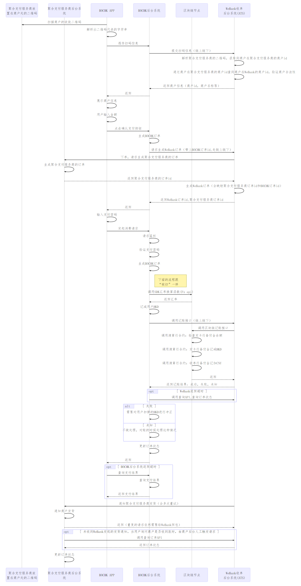
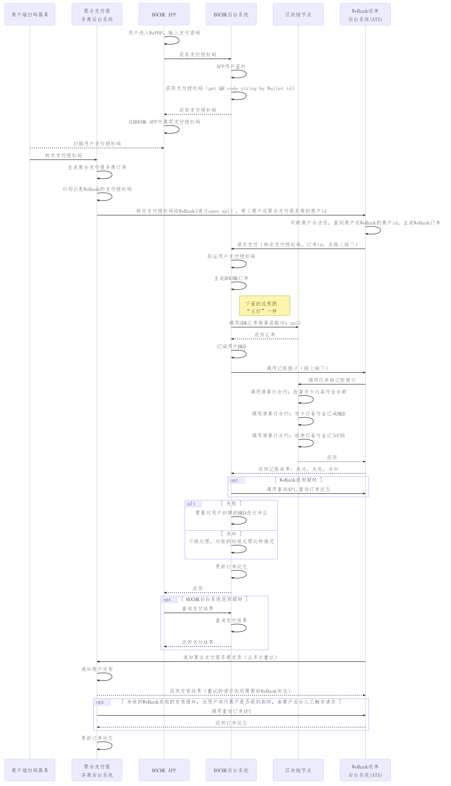

<html>
<head>
<style>
*
{
   font-family: 仿宋;
}

@media screen {
  div.divFooter {
    display: none;
  }
}
@media print {
  div.divFooter {
    position: fixed;
    bottom: 0;
  }
}
</style>
<!--区块链跨境钱包境外合作行前置SDK使用文档-->
</head>
<body>
</body>
</html>


## 1. 背景介绍
* 项目介绍：本项目是使用区块链技术，连接境外合作行，内地商户接入行，跨境跨境清算行和内地商户，解决境外游客来中国大陆消费的移动支付痛点，探索区块链在低风险金融场景中的应用。
* 本文档是区块链跨境钱包境外合作行SDK的使用说明。通过这个SDK，可以简化境外合作行后台server调用区块链的复杂度。直接使用函数调用的方式使用区块链。
* 背景知识：区块链跨境钱包项目的架构。


## 2. 前提条件

* 目前只提供了JAVA版本的SDK。需要JDK至少 1.7 。


## 3. 境外合作行前置server上下游的调用逻辑

```mermaid
graph LR
         F-->G[其他区块链节点]
         G-->F
subgraph 境外合作行机房
         A[集成了区块链跨境钱包SDK的境外合作行server] --https-->D[境外合作行前置server]
         D --https-->A
         D --https-->F[境外合作行区块链节点]
         F --https-->D
         end
```


* 境外合作行前置server由微众银行提供代码和部署文档，部署在境外合作行的服务器上。
* 境外合作行区块链节点也是部署在境外合作行的服务器上。
* SDK封装了一系列的函数，通过简单直接的函数调用，境外合作行可以调用到区块链上的合约，例如调用SDK提供的"注册区块链跨境钱包接口"函数，或者调用"给区块链跨境钱包充值接口"函数。


## 4. 主扫模式A（每个商户向用户展示固定的二维码）

#### 4.1. 介绍

聚合支付服务商在每个商户处会放置不同的二维码，港中银(BOCHK)的用户使用BOCHK APP扫描这个二维码后，通过跨境支付的能力，可以直接付款给WeBank，由WeBank作为内地商户接入行，再把这一笔钱结算给商户。


#### 4.2. 解释
* 商户展示由聚合支付服务商提供的固定二维码，不同的二维码能区分不同的商户。
* 由用户在APP中输入金额。
* WeBank会调用聚合支付服务商的后台生成订单，并通过聚合支付服务商通知商户发货。
* 每日WeBank会跟聚合支付服务商代理的每个商户单独结算（作为内地商户接入行），并跟聚合支付服务商结算。

#### 4.3. 主扫模式A时序图

* 为简化，合并了BOCHK的后台server，统称为“BOCHK后台系统”




<!-- 不要下面的逻辑了 -->
<!-- * 异常情况：如果跨境清算行发起场切以后，才收到聚合支付服务商的发货成功通知，这个时候需要当做异常处理，ATS不要去更新已经有场切码的这笔交易的发货状态，而是标记为一个特殊的状态或者单独记一笔流水，人工处理的时候需要参考这个流水。因为已经有场切码，证明跨境清算行已经开始清算，这个时候ATS就算把发货状态修改为成功，跨境清算行也不会把这笔钱清算给WeBank。这种交易需要人工处理。
更细一点，清算开始后的发货成功通知，有可能是多种情况：
  1. 目前记账流水的发货状态是成功或者失败状态，说明本身它是一个重复的通知，这个通知可以直接忽略。
  2. 目前记账流水的发货状态是未知状态，则这个通知需要保存下来，用于人工查看这个结果并处理（即BOCHK对账处理逻辑图里面的*1和*2）。 -->


## 5. 被扫模式

#### 5.1. 介绍
BOCHK APP 请求生成支付授权码，聚合支付服务商的商户使用扫码枪扫码这个支付授权码，识别到是WeBank跨境支付的授权码，转发给WeBank的后台，由WeBank去BOCHK请求支付（请求扣款）。最后通知聚合支付服务商的后台发货。


#### 5.2. 被扫模式时序图




## 6. 主扫模式B（为每个订单生成不同的二维码模式，目前不需要支持）

#### 6.1. 介绍

 主扫模式是否支持按订单生成二维码，即由商户输入金额，并提前生成订单，然后给用户展示的二维码代表的是这个订单，然后用户扫码后，直接输入支付密码（不需要再输入金额），最后支付成功。

#### 6.2. 解释
* 商户提前输入商品价格，生成订单，并生成代表这笔订单的二维码。
* 用户扫描这个二维码，即表示对这笔订单进行支付。
* BOCHK调用记账接口的时候需要传入交易类型字段，区分主扫还是被扫。被扫模式下，记账请求的返回需要返回商户的id，商户的名称等信息。


## 7. SDK接口文档

#### 7.1. 注册区块链跨境钱包接口

* 调用示例:

```java
// {SPECIFIC_VALUE} 替换为对应的值，见“参数说明”
CreateVirtualAccountArgs args = new CreateVirtualAccountArgs();
args.setOrgId({SPECIFIC_VALUE}); //境外合作行在链上的唯一标示，由链提前分配好。
args.setAccount({SPECIFIC_VALUE}); //"境外合作行用户的唯一标示"
args.setCurrency({SPECIFIC_VALUE}); //币种
args.setCurrDate({SPECIFIC_VALUE}); //日期
args.setFirstName({SPECIFIC_VALUE}); //first name
args.setLastName({SPECIFIC_VALUE}); //last name
args.setIdType({SPECIFIC_VALUE}); //证件类型
args.setUserId({SPECIFIC_VALUE}); //证件号码
args.setUserCard({SPECIFIC_VALUE}); //用户绑定的银行卡号
IssueBankRequest request = new IssueBankRequest();

ResponseStruct<CreateVirtualAccountStatus> responseStruct = issuingBankClient.createVirtualAccount(transactionArgs);

if (0 == responseStruct.getErrorCode()
	&& responseStruct.getResult().isCreateVirtualAccountResultSucc()) {
    log.info("status : createVirtualAccount success");
} else {
    log.info("status : createVirtualAccount failed");
}
```

* CreateVirtualAccountArgs说明:

|字段名|必选|类型|说明|
|:----    |:---|:----- |----- |
|orgId  | 是  | String | 境外合作行在链上的唯一标示，由链提前分配好。 |
|userAccount  |是  | String| 境外合作行用户在链上的唯一标示，要求在境外合作行内唯一（可用卡号的md5值），在链下可以与用户的卡号进行映射即可  |
|currency |是  | Integer |用户账户币种  |
|currDate |是  | String |交易发起的日期,YYYYMMDD  |
|firstName |是  |String |first name  |
|lastName |是  |String |last name   |
|idType |是  |String |证件类型 01:护照;02:驾照 |
|userId |是  |String |证件号码   |
|userCard |是  |String |用户绑定的银行卡号 |

* 返回结构体ResponseStruct\<CreateVirtualAccountResult>结构说明：

ResponseStruct:

|字段名|类型|说明|
|:----  |:----- |----- |
|errorCode  | Integer|请求后端服务是否成功的错误码，0表示成功调用到合约，但是否成功执行合约需要查看result  |
| result | CreateVirtualAccountResult |交易执行的result |
|message | String |交易执行的返回提示  |
|rawResponse | String |原始的返回json字符串回包结构，正常情况下不需要使用，如果返回的结构体里面不包含某个新增的字段，可以直接解析这个获取         |

CreateVirtualAccountResult:

|字段名|类型|说明|
|:----  |:----- |----- |
|isCreateVirtualAccountResultSucc  | boolean| 创建账户是否成功|

#### 7.2. 查询账户是否存在

* 调用示例:

```JAVA
// {SPECIFIC_VALUE} 替换为对应的值，见“参数说明”
IssuingBankUserAccountArgs transactionArgs = new IssuingBankUserAccountArgs();
transactionArgs.setOrgId({SPECIFIC_VALUE});
transactionArgs.setAccount({SPECIFIC_VALUE}); // 境外合作行用户在链上的唯一标示，要求在境外合作行内唯一（可用卡号的md5值），在链下可以与用户的卡号进行映射即可
ResponseStruct<IsAccountExistResult> responseStruct = issuingBankClient.isAccountExists(transactionArgs);

log.info("responseStruct body : {}" + responseStruct);
if (0 == responseStruct.getErrorCode() && responseStruct.getResult().isAccountExist()) {
    log.info("result : userAccount does exist");
} else {
    log.info("result : userAccount is not exist");
}
```

* IssuingBankUserAccountArgs参数说明:

|字段名|必选|类型|说明|
|:----    |:---|:----- |----- |
|orgId  | 是  | String | 境外合作行在链上的唯一标示，由链提前分配好。 |
|userAccount  |是  | String| 境外合作行用户在链上的唯一标示，要求在境外合作行内唯一（可用卡号的md5值），在链下可以与用户的卡号进行映射即可  |

* 返回结构体ResponseStruct<IsAccountExistResult>结构说明：

ResponseStruct:

|字段名|类型|说明|
|:----  |:----- |----- |
|errorCode  | Integer|请求后端服务是否成功的错误码，0表示成功调用到合约，但是账户是否存在需要查看result  |
| result | IsAccountExistResult |返回的result |
|message | String |交易执行的返回提示  |
|rawResponse | String |原始的返回json字符串回包结构，正常情况下不需要使用，如果返回的结构体里面不包含某个新增的字段，可以直接解析这个获取         |

IsAccountExistResult:

|字段名|类型|说明|
|:----  |:----- |----- |
|isAccountExist  | boolean| 账户是否存在|

#### 7.3. 从区块链获取汇率接口

* 调用示例:

```JAVA
CurrencyType currencyType = CurrencyType.CURRENCY_TYPE_HKD;

ResponseStruct<GetExchangeRateResult> responseStruct = issuingBankClient.getExchangeRate(currencyType);

log.info("respObj body : {}", responseStruct);
if (0 == responseStruct.getErrorCode()) {
    log.info("status : getExchangeRate success");
    log.info("exchange : {} ", responseStruct.getResult().getExchange());
    log.info("exTimestamp : {} ", responseStruct.getResult().getExTimestamp());

} else {
    log.info("status : getExchangeRate failed");
}
```

* 参数说明:

|字段名|必选|类型|说明|
|:----    |:---|:----- |----- |
|currencyType  | 是  | CurrencyType | 币种 |

* 返回结构体ResponseStruct<GetExchangeRateResult>结构说明：

ResponseStruct:

|字段名|类型|说明|
|:----  |:----- |----- |
|errorCode  | Integer|请求后端服务是否成功的错误码，0表示成功调用到合约，但是账户是否存在需要查看result  |
| result | GetExchangeRateResult |返回的result |
|message | String |交易执行的返回提示  |
|rawResponse | String |原始的返回json字符串回包结构，正常情况下不需要使用，如果返回的结构体里面不包含某个新增的字段，可以直接解析这个获取          |

GetExchangeRateResult:

|字段名|类型|说明|
|:----  |:----- |----- |
|exchange  | Integer| 兑换汇率,消费的时候使用的汇率  |
|refundExchange  | Integer| 退货时的兑换汇率 |
|exTimestamp  | Integer| 跨境清算行上报汇率的时间戳，当做汇率的流水号，需要在记账时传递给内地商户接入行 |


#### 7.4. 下单接口
* 调用示例:

```JAVA
String bizNo = "BOCHK17060117545000000043";
PlaceOrderArgs transactionArgs = new PlaceOrderArgs();
transactionArgs.setIbBizNo(bizNo);

ResponseStruct<PlaceOrderResult> responseStruct = issuingBankClient.placeOrder(transactionArgs);

log.info("respObj body : {}", responseStruct);
if (0 == responseStruct.getErrorCode() && responseStruct.getResult().isSucc()) {
    log.info("status : placeOrder success");
} else {
    log.info("status : placeOrder failed");
}
```
* PlaceOrderArgs参数说明:

|字段名|类型|说明|
|:----    |:---|:----- |
| ibBizNo | String| 境外合作行交易流水号，每一笔记账需保证唯一性  |

* 返回结构体ResponseStruct \<PlaceOrderResult>结构说明：

ResponseStruct:

|字段名|类型|说明|
|:----  |:----- |----- |
|errorCode  | Integer|请求后端服务是否成功的错误码，0表示成功调用到合约，但是否成功执行合约需要查看result  |
| result | PlaceOrderResult |交易执行的result |
|message | String |交易执行的返回提示  |
|rawResponse | String |原始的返回json字符串回包结构，正常情况下不需要使用，如果返回的结构体里面不包含某个新增的字段，可以直接解析这个获取          |

PlaceOrderResult:

|字段名|类型|说明|
|:----  |:----- |----- |
|isSucc | boolean| 下单是否成功|
|ibBizNo | boolean| 境外合作行交易流水号，原封不动返回|
|abBizNo | boolean| 内地商户接入行订单id (即WeBank订单id)|
|msBizNo | boolean| 聚合支付服务商订单id|


#### 7.5. 消费交易记账接口

* 调用示例:

```JAVA
// {SPECIFIC_VALUE} 替换为对应的值，见“参数说明”
RecordAccountsPayableArgs transactionArgs = new RecordAccountsPayableArgs();
transactionArgs.setDate({SPECIFIC_VALUE});

transactionArgs.setIbBizNo({SPECIFIC_VALUE});
transactionArgs.setAbBizNo({SPECIFIC_VALUE});
transactionArgs.setMsBizNo({SPECIFIC_VALUE});
transactionArgs.setOrgBizNo({SPECIFIC_VALUE});

transactionArgs.setFromOrg({SPECIFIC_VALUE});
transactionArgs.setFromUserId({SPECIFIC_VALUE});
transactionArgs.setFromUserName({SPECIFIC_VALUE});
transactionArgs.setToOrg({SPECIFIC_VALUE});
transactionArgs.setToUserId({SPECIFIC_VALUE});
transactionArgs.setToUserName({SPECIFIC_VALUE});

transactionArgs.setTxType({SPECIFIC_VALUE});
transactionArgs.setIsStrike({SPECIFIC_VALUE});
transactionArgs.setRmbAmt({SPECIFIC_VALUE});
transactionArgs.setFxRate({SPECIFIC_VALUE});
transactionArgs.setTxAmt({SPECIFIC_VALUE});
transactionArgs.setCurrency({SPECIFIC_VALUE});
transactionArgs.setTxTime({SPECIFIC_VALUE});
transactionArgs.setUserAppIp({SPECIFIC_VALUE});
transactionArgs.setTradeType({SPECIFIC_VALUE});

ResponseStruct<RecordAccountsPayableResult> responseStruct = issuingBankClient.recordAccountsPayable(transactionArgs);

log.info("respObj body : {}", responseStruct);
if (0 == responseStruct.getErrorCode() && responseStruct.getResult().isSucc()) {
    log.info("status : recordAccountsPayable success");
} else {
    log.info("status : recordAccountsPayable failed");
}
```

* 参数说明:

|字段名|类型|说明|
|:----    |:---|:----- |
| date | String|交易日期,YYYYMMDD  |
|ibBizNo | String |境外合作行交易流水号，每一笔记账需保证唯一性 |
|abBizNo | String |内地商户接入行订单id (即WeBank订单id) |
|msBizNo | String |聚合支付服务商订单id|
|orgBizNo | String |原交易流水号,冲账交易才需要，其它交易不需要 |
|fromOrg | String |境外合作行的标示,境外合作行在跨境清算行注册的标示 |
|fromUserId | String | 用户在境外合作行注册的唯一标示|
|fromUserPwd | String | 境外合作行的用户设置的密码|
|toOrg | String |内地商户接入行在跨境清算行注册的标示 |
|toUserid | String |商户在内地商户接入行注册的唯一标示 |
|toUsername | String |内地商户接入行的商户名称 |
|txType | Integer | 交易类型; 13：消费;  31：退货|
|isStrike| Integer | 是否冲账;1：冲账； 0：非冲账|
|rmbAmt | Integer |订单的人民币金额，精度到分 |
|fxRate | Integer |结汇汇率 |
|exTimestamp | Integer |结汇汇率 |
|txAmt | Integer |付款方钱包原币扣款金额,精度到分,例如BOCHK就是传入HKD消费的金额|
|currency | CurrencyType |消费币种 |
| txTime| long | 时间戳，精确到毫秒|
| userAppIp| String | 用户手机的ip，需要可以判断出用户当前在哪个城市消费|
| tradeType| TradeType | 支付类型; TYPE_MERCHANT_ID_QRCODE: 主扫模式A; TYPE_PAYMENT_AUTH_CODE： 被扫模式|

* 返回结构体ResponseStruct \<RecordAccountsPayableResult>结构说明：

ResponseStruct:

|字段名|类型|说明|
|:----  |:----- |----- |
|errorCode  | Integer|请求后端服务是否成功的错误码，0表示成功调用到合约，但是否成功执行合约需要查看result  |
| result | RecordAccountsPayableResult |交易执行的result |
|message | String |交易执行的返回提示  |
|rawResponse | String |原始的返回json字符串回包结构，正常情况下不需要使用，如果返回的结构体里面不包含某个新增的字段，可以直接解析这个获取          |

RecordAccountsPayableResult:

|字段名|类型|说明|
|:----  |:----- |----- |
|isSucc | boolean|  记账是否成功|


#### 7.6. 生成支付授权码的接口

* 调用示例:

```JAVA
String paymentAuthCode = issuingBankClient.generatePaymentAuthCode({SPECIFIC_VALUE});

log.info("paymentAuthCode : {}", paymentAuthCode);
```

* 参数说明:

|字段名|必选|类型|说明|
|:----    |:---|:----- |----- |
|userAccount  | 是  | String | 用户的账户id |

* 返回说明：

|字段名|必选|类型|说明|
|:----    |:---|:----- |----- |
|PaymentAuthCode  | 是  | String | 根据/dev/urandom生成的支付授权码 |


#### 7.7. 境外合作行接收内地商户接入行的请求支付通知

* 调用示例:

```JAVA
// 定义一个类，实现DeductMoneyNotifyCallback接口。需要实现onPush函数
public class DeductMoneyNotifyCallbackImpl implements DeductMoneyNotifyCallback {

    private static final Logger log = LoggerFactory.getLogger(DeductMoneyNotifyCallbackImpl.class);

    /**
     * 请求扣款的通知的回调，透传了支付授权码, 境外合作行需要自己定义一个类似的类去implements DeductMoneyNotifyCallback，并实现onPush函数
     *
     * @param args 境外合作行传递过来的消息包体, 见参数说明
     * @return 返回给发送端的包体，必须回复，否则发送端会因收不到回复而超时
     */
    public ChannelResponse onPush(DeductMoneyNotifyArgs args) {
        log.info("receive DeductMoneyNotify");
        log.info("notify body : {}", args);
        return null;
    }
}
```

```JAVA
/**
 * 调用registerDeductMoneyNotifyCallback注册回调
 * 如果有消息通知，SDK会自动调用DeductMoneyNotifyCallbackImpl类里面实现的onPush函数
 */
DeductMoneyNotifyCallbackImpl callback = new DeductMoneyNotifyCallbackImpl();
issuingBankClient.registerDeductMoneyNotifyCallback(callback);
```

* DeductMoneyNotifyArgs参数说明:

|字段名|必选|类型|说明|
|:----    |:---|:----- |----- |
|paymentAuthCode  |是  | String| 商户透传过来的支付授权码  |
|merchantSvcId  |是  | String| 聚合支付服务商id  |
|merchantSvcName  |是  | String| 聚合支付服务商name |
|merchantId  |是  | String| 商户id  |
|merchantName  |是  | String| 商户名字 |
|abBizNo  |是  | String| 内地商户接入行订单id (即WeBank订单id)  |
|msBizNo  |是  | String| 聚合支付服务商订单id  |
|rmbAmt  |是  | String| 订单的人民币金额，精度到分  |
|extraData  |是  | String| 其他信息  |


#### 7.8. 境外合作行获取跨境清算行清算结果状态

* 调用示例:

```JAVA
// {SPECIFIC_VALUE} 替换为对应的值，见“参数说明”
ResponseStruct<GetClearingStatusResult> responseStruct = issuingBankClient.getClearingStatus({SPECIFIC_VALUE}, {SPECIFIC_VALUE}); // 填入跨境清算行场切的checkcode

log.info("respObj body : {}" + responseStruct);
if (0 == responseStruct.getErrorCode() && responseStruct.getResult().isFinish()) {
    log.info("status : Clearing finished");
} else {
    log.info("status : Clearing have not finished");
}
```

* 参数说明:

|字段名|必选|类型|说明|
|:----    |:---|:----- |----- |
|orgId  |是  | String| 境外合作行的机构id  |
|checkCode  |是  | Integer| 清算场次标识（对账码）  |

* 返回结构体ResponseStruct\<GetClearingStatusResult>结构说明：

ResponseStruct:

|字段名|类型|说明|
|:----  |:----- |----- |
|errorCode  | Integer|请求后端服务是否成功的错误码，0表示成功调用到合约，但是场切清算是否结束需要查看result  |
| result | GetClearingStatusResult |返回的result |
|message | String |交易执行的返回提示  |
|rawResponse | String |原始的返回json字符串回包结构，正常情况下不需要使用，如果返回的结构体里面不包含某个新增的字段，可以直接解析这个获取          |

GetClearingStatusResult:

|字段名|类型|说明|
|:----  |:----- |----- |
|isFinish  | boolean| 跨境清算行清算结果，1：已清算完成 |

#### 7.9. 提交扫码信息，获取商户信息

* 调用示例:

```JAVA
String qrCodeStr = "https://haoj.com/ewfdsfewfdsfdsx1009";
ResponseStruct<GetMerchantInfoResult> responseStruct = issuingBankClient.getMerchantInfoByQrCodeString(qrCodeStr);

log.info("respObj body : {}" + responseStruct);
if (0 == responseStruct.getErrorCode()) {
    if (responseStruct.getResult().isValid()) {
        log.info("status : getMerchantInfoByQrCodeString succ");
    } else {
        log.info("status : qrCode is invalid");
    }
} else {
    log.info("status : getMerchantInfoByQrCodeString failed!");
}
```

* 参数说明:

|字段名|必选|类型|说明|
|:----    |:---|:----- |----- |
|qrCodeString  |是  | String| 扫描商户的二维码获取到的字符串  |

* 返回结构体ResponseStruct\<GetMerchantInfoResult>结构说明：

ResponseStruct:

|字段名|类型|说明|
|:----  |:----- |----- |
|errorCode  | Integer|请求后端服务是否成功的错误码，0表示成功调用到合约，但是场切清算是否结束需要查看result  |
| result | GetMerchantInfoResult |返回的result |
|message | String |交易执行的返回提示  |
|rawResponse | String |原始的返回json字符串回包结构，正常情况下不需要使用，如果返回的结构体里面不包含某个新增的字段，可以直接解析这个获取     |

GetMerchantInfoResult:

|字段名|类型|说明|
|:----  |:----- |----- |
|isValid  | boolean| 是否合法二维码 |
|merchantSvcId  | String| 聚合支付服务商id |
|merchantSvcName  | String| 聚合支付服务商name|
|merchantId  | String| 商户id |
|merchantName  | String| 商户name |
|extraData  | String|  额外信息 |
|message  | String| 错误信息 |


## 8. 工具

由WeBank提供的SDK，执行```gradle build```后会生产dist目录，在dist目录里面执行下面的命令即可使用相应的工具。

* 链上链下health check工具使用方式

```sh
./wepop_util.sh DirectMsg WB
```

* 读合约health check工具使用方式（读汇率）

```sh
./wepop_util.sh getExchangeRate 1
```

* 发起场切的工具使用方式（场切成功后会通知WeBank）

传入的第二个参数是requestId，用于保证操作执行的幂等，如果传入一个已经使用过的requestId，不会产生场切效果，仅仅会返回上次执行requestId对应的场切码。

```sh
./wepop_util.sh setCheckCodeTag 123
```


## 9. 技术支持

SDK维护人：张俊麒</br>邮箱：junqizhang@webank.com


## 10. 版权说明
本文档版权归深圳前海微众银行股份有限公司所有，并保留一切权利。未经书面许可，任何公司和个人不得将此文档中的任何部分公开、转载或以其他方式散发给第三方。
